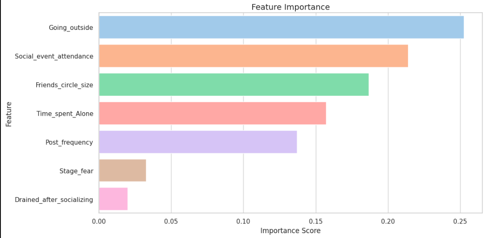

# personality_classification
This project focuses on personality classification using machine learning algorithms. It includes data preprocessing, exploratory data analysis (EDA), feature engineering, model training, and performance evaluation to accurately predict personality categories from user characteristics and behavioral patterns.

## Problem Statement
Personality Classification Using Behavioral and Social Activity Data

Understanding whether a person is more likely to be an Introvert or an Extrovert can be valuable in areas such as psychology, education, recruitment, and social behavior analysis. Personality traits often influence how individuals interact with others, participate in social events, spend time alone, and engage in online activities.

This project aims to develop a machine learning model that can accurately classify a person's personality type (Introvert or Extrovert) based on behavioral and social characteristics such as:

- Time spent alone
- Stage fear
- Social event attendance
- Frequency of going outside
- Feeling drained after socializing
- Size of friends circle
- Social media post frequency
## Dataset 
#Target Variable

**Personality

- Introvert
- Extrovert
#Input Features
- Time_spent_Alone
- Stage_fear
- Social_event_attendance
- Going_outside
- Drained_after_socializing
- Friends_circle_size
- Post_frequency

## Objectives
- Analyze personality-related data
- Identify important features influencing personality traits
- Build and compare machine learning models
- Predict personality categories accurately

## Technologies Used
- Python
- Pandas
- NumPy
- Matplotlib
- Seaborn
- Scikit-Learn
- Jupyter Notebook

## Workflow
1. Data Collection
2. Data Preprocessing
3. Exploratory Data Analysis
4. Feature Engineering
5. Model Training
6. Model Evaluation
7. Personality Prediction

## screenshot 

## Results
-  Accuracy : 99%
The trained model successfully classifies personality categories and provides insights into the most influential factors affecting personality predictions.
